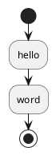
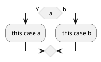
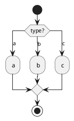
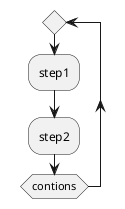

#uml #plantuml

## 开始/停止/结束

```plantuml
@startuml
start
:hello;
:word;
stop
@enduml
```

## 条件

```plantuml
@startuml
if (a) then(Y)
: this case a;
else (b)
: this case b;
endif
@enduml
```

水平模式
```
```

switch

```plantuml
@startuml
start
switch (type?)
case (a)
: a;
case (b)
: b;
case (c)
: c;
endswitch
stop
@enduml
```

## 重复循环

```plantuml
@startuml
repeat
:step1;
:step2;
repeat while (contions)
@enduml
```
i


公司本次多数同事离开的主要原因是什么，为什么感觉上海的同事较多？
公司后续的业务主要方向是什么，上海后续的定位和发展方向？
后续是否还会有同事持续离开